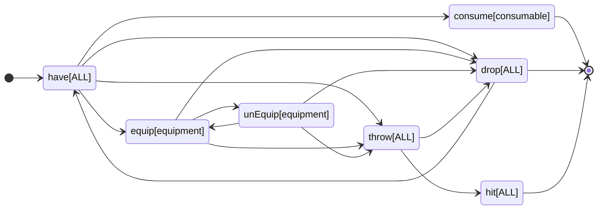
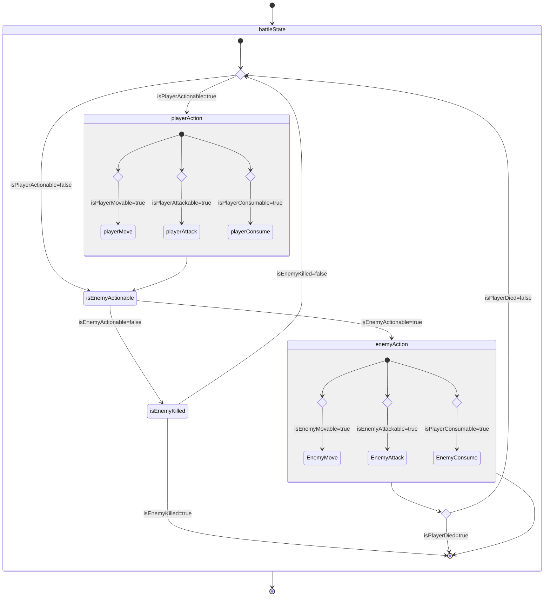
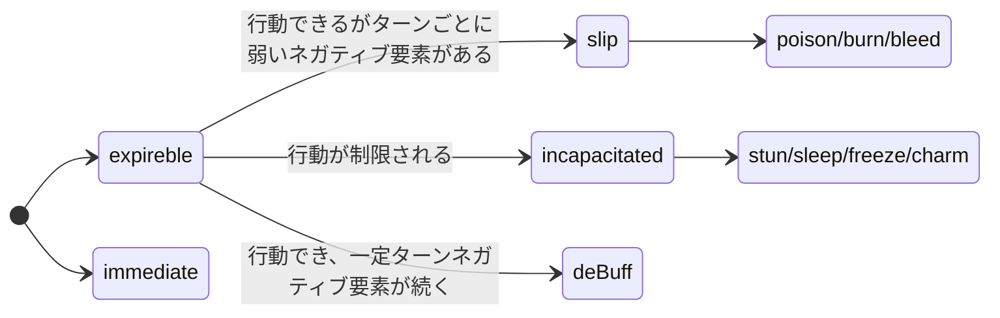
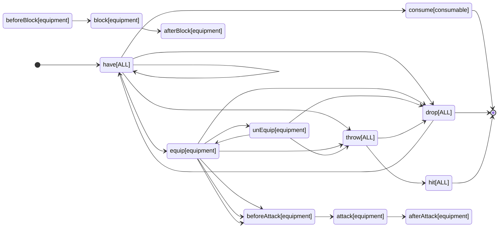

# rogue_adventure

このプロジェクトは、Flutter Flameを使用して開発されたゲームです。以下のディレクトリ構成を採用しています。

Markdown
# ディレクトリ構成

## ディレクトリ

### assets/

- 画像、音源、フォントなどのアセットファイルを格納します。
    - `image/`: 背景、キャラクター、オブジェクトなどの画像ファイル
    - `sounds/`: BGM、効果音などの音源ファイル
    - `fonts/`: ゲーム内で使用するフォントファイル

### lib/

- ゲームのソースコードを格納します。
    - `main.dart`: アプリの起動処理を担hitします。
    - `game/`: ゲーム本体のコードを格納します。
        - `my_game.dart`: ゲームクラスを定義します。
        - `components/`: ゲーム画面に表示されるコンポーネントを格納します。
        - `entities/`: ゲーム世界のエンティティを格納します。
        - `scenes/`: ゲームの各シーンを格納します。
        - `systems/`: ゲーム全体の動作を制御するシステムを格納します。
    - `utils/`: ゲーム開発で汎用的に使用されるユーティリティコードを格納します。

### pubspec.yaml

- プロジェクトで使用されるライブラリや依存関係を定義します。

### README.md

- プロジェクトの概要、使用方法などを説明します。

## 各ディレクトリ詳細

#### assets/

ゲームに必要な画像、音源、フォントなどを格納します。

#### image/

背景、キャラクター、オブジェクトなどの画像ファイルを格納します。

#### sounds/

BGM、効果音などの音源ファイルを格納します。

#### fonts/

ゲーム内で使用するフォントファイルを格納します。

### lib/

ゲーム本体のコードや、ゲーム開発で汎用的に使用されるユーティリティコードなどを格納します。

#### main.dart

アプリの起動処理を担hitします。

#### game/

ゲーム本体のコードを格納します。

##### my_game.dart

ゲームクラスを定義します。

##### components/

ゲーム画面に表示されるコンポーネントを格納します。

##### entities/

ゲーム世界のエンティティを格納します。

##### scenes/

ゲームの各シーンを格納します。

##### systems/

ゲーム全体の動作を制御するシステムを格納します。

#### utils/

ゲーム開発で汎用的に使用されるユーティリティコードを格納します。

### pubspec.yaml

プロジェクトで使用されるライブラリや依存関係を定義します。

### README.md

プロジェクトの概要、使用方法などを説明します。

クラス図

classDiagram

アイテムのライフサイクル

ゲームの進行 プロセス
## 図

AdventureEffectの種類
(有効化: AdventureEffectが発火しうる状態になる)
- キャラクターに能力が付与される
- 能力が付与された状態で条件により発動する
  - 攻撃成功/失敗時の一定確率
  - 
  - 防御成功/失敗時の一定確率
  - 
  - 常時

AdventureEffectの発火タイミング

